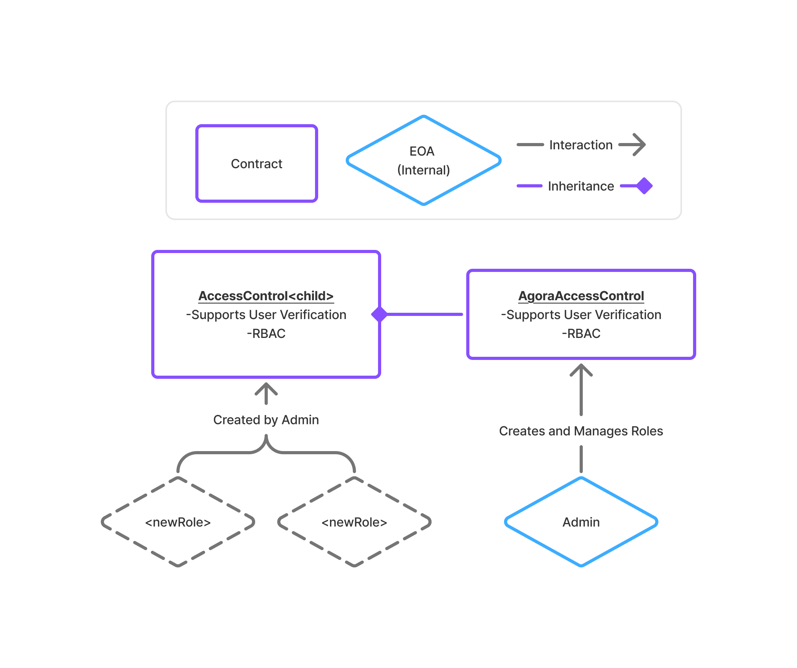
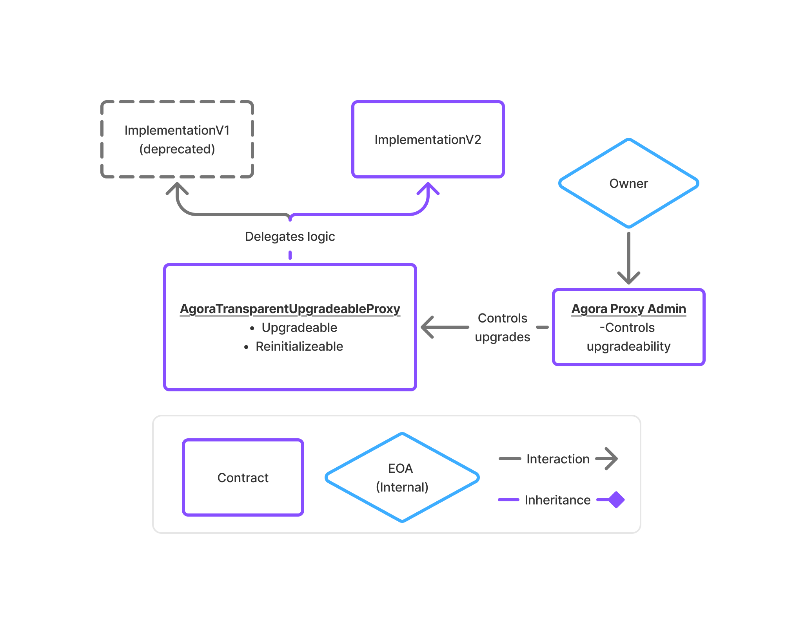

# Agora Contracts (EVM)

Agora contracts implements the base contracts used for access control and contract upgradeability across the agora ecosystem. This repository contains the smart contracts and related code.

## Prerequisites

Before you begin, ensure you have met the following requirements:

- **Node.js**: You need to have [Node.js](https://nodejs.org/) installed.
- **npm**: Node.js package manager, which is installed with Node.js.
- **Solidity Compiler**: Required for compiling smart contracts. You can use [Forge](https://book.getfoundry.sh/getting-started/installation) from the Foundry toolkit.

## Installation

To set up the project locally, follow these steps:

1. **Install dependencies**:
   ```bash
   npm install
   ```

2. **Compile the contracts**:
   ```bash
   npm run build
   ```

## High level Organization of files

- `src/contracts/access-control` This directory contains all base contracts used for access-control 
- `src/contracts/proxy` This directory contains all base contracts used for contract upgradeability
- `src/contracts/interfaces` This directory contains all interfaces required to compile

### Ecosystem Participants

#### AccessControl


#### Proxy


